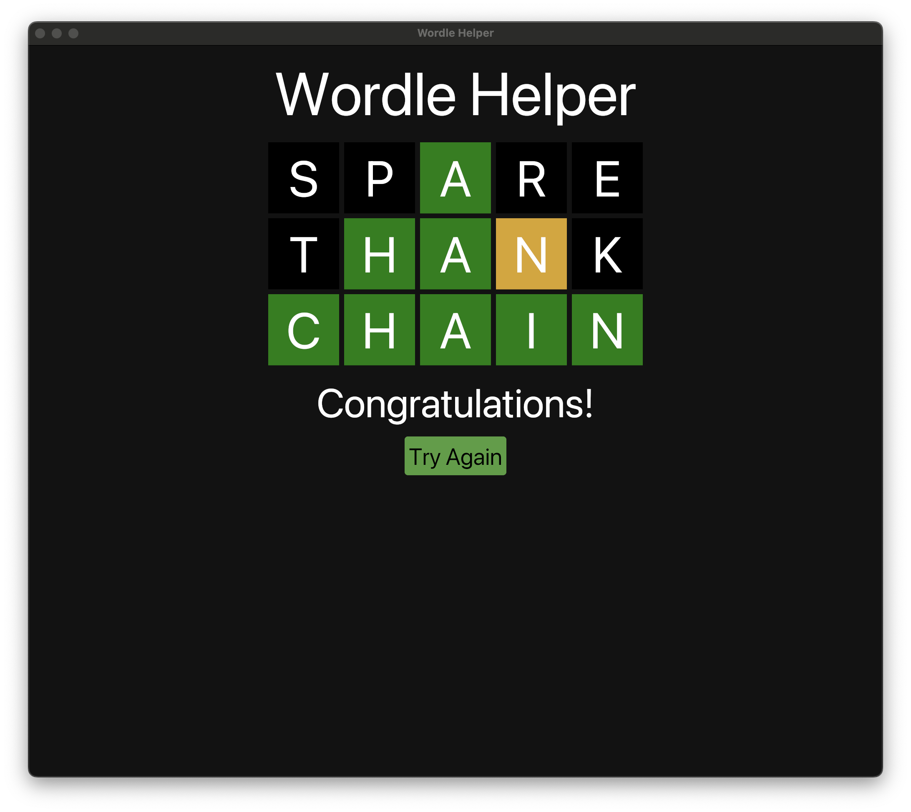

# Wordle Helper
A program to help you solve Wordle puzzles. Written in Rust and [Iced](https://github.com/iced-rs/iced).

The app starts with a random word from the set TEARS, STERN, EARNT, ROAST, ROUND, SPARE, MATER and FEAST. Click on each letter to specify if it is:
- Correct and in the correct position (green)
- Correct but in the wrong position (yellow)
- Incorrect (Black)

Once every letter has a status, click on the "Guess" button to get the next word.

If all letters are marked as correct, the app will display:  **Congratulations!**.  If there is no more words to guess, the app will display:  **I Give Up, Sorry!**.

